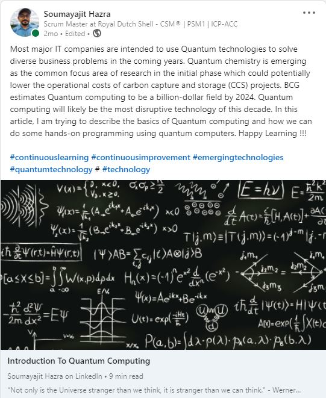
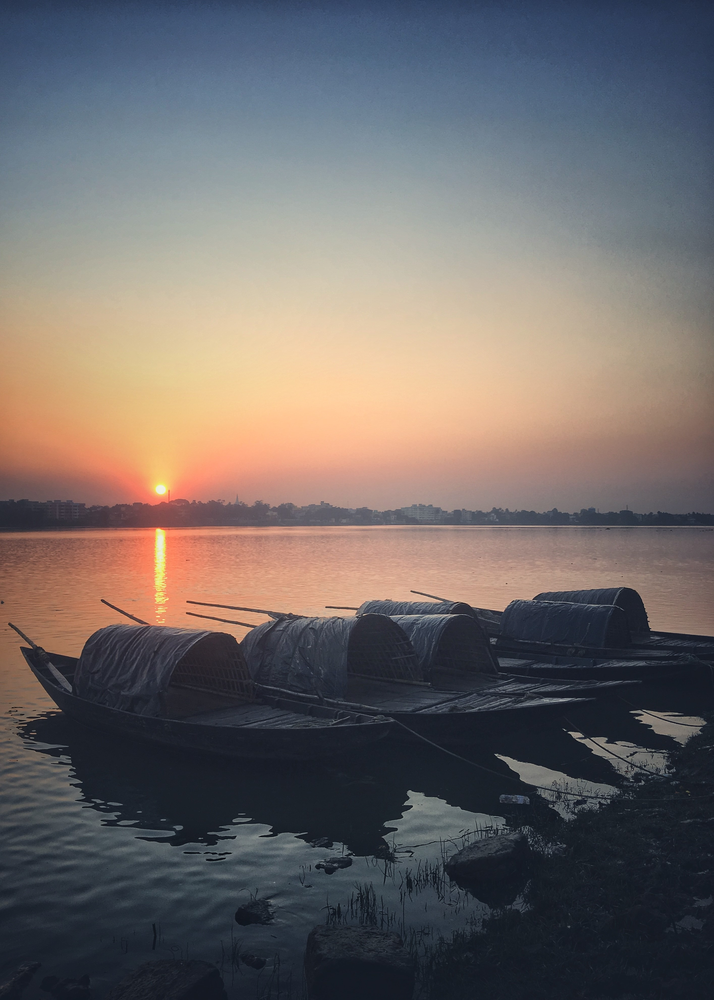
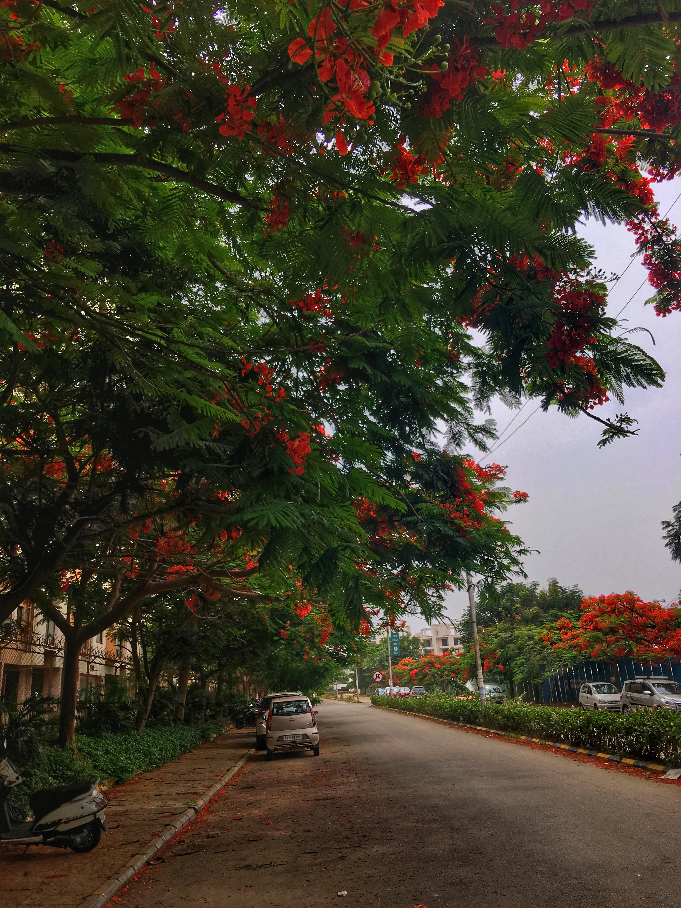

### Hi there 👋, this is Soumayajit Hazra from India !! 
#### I am a Father, Husband, Developer, Teacher, Change Enabler, Amateur Photographer, Guitar Player and hardcore blues fan !!!

&nbsp;&nbsp;    &nbsp;
 

- 🔭 I’m currently working on productization journey 
- 🌱 I’m currently learning Quantum Computing using Qiskit 
- 👯 I’m looking to collaborate on Qiskit 
- 🤔 I’m looking for help with Understanding quantum search algorithm 
- 💬 Ask me about career advice, programming stuffs or music 
- 📫 How to reach me:  LinkedIn or Facebook 
- ⚡ Fun fact: No professional services on weekends  

As part of my day to day work, I assist development teams to become self-organized and help them to deliver quality code faster.

---

### Professional Summary

- 14 years of overall IT industry experience encompassing a wide range of skill set, roles and industry verticals such as retail, banking and telecom. 
- Certified Scrum Master with over 4 years of experience in supporting scrum, facilitating scrum ceremonies, mentoring and coaching the team in several agile aspects. Experience in working under agile environment and tools like Azure DevOps, Rally, JIRA and Confluence. 
- Certified Agile coach with experience in mentoring and coaching the team with different agile methodologies like Scrum, Kanban, Scrumban, SAFe and XP and lead them to successful agile transformation.
- Strong programming skill using languages like Java, Python, C++ , Dart, Qiskit etc.
- Liaise between business and technical personnel to ensure a mutual understanding of processes and applications.
- Assessing the impact of changes, analyzing and documenting requirements and then supporting the communication and delivery of those requirements with clients.
- Experience in leading and managing teams from different geographic locations.
- Hands on experience in emerging technologies like Blockchain programming using Hyperledger Fabric , Quantum computing using IBM Qiskit.

---
🧰 **Languages, Tools & Professional Certifications**

                                 

 

📖 **Check out my latest article**

---

🎸 **Personal interests**

Music and photography are two of essential part of my life. 

	
| | | |
|:-------------------------:|:-------------------------:|:-------------------------:|
| |||
| | ||
